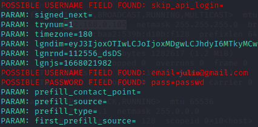

# Simulação de Ataque de Phishing Educacional

## Objetivo do Projeto
Este projeto tem como objetivo demonstrar, em um ambiente controlado e ético, como ataques de phishing podem ser realizados. A finalidade é educar sobre práticas de segurança digital e reforçar a importância da proteção contra ameaças cibernéticas.

## Ferramentas Utilizadas
- **Kali Linux**: Sistema operacional focado em cibersegurança.
- **SET Toolkit (Social-Engineer Toolkit)**: Ferramenta para simulação de ataques de engenharia social.

## Configuração da Simulação
1. **Acesso ao ambiente seguro**: 
   - Entre no modo superusuário: `sudo su`
   - Inicie o SET Toolkit: `setoolkit`
2. **Seleção do Tipo de Ataque**:
   - Opção: *Social-Engineering Attacks*
3. **Escolha do Vetor de Ataque**:
   - Opção: *Web Site Attack Vectors*
4. **Método de Ataque**:
   - Escolha: *Credential Harvester Attack Method*
   - Opção subsequente: *Site Cloner*
5. **Configuração de Rede**:
   - Verifique o endereço IP da máquina: `ifconfig`
6. **URL de Clonagem**:
   - Insira a URL alvo de exemplo (neste caso, um exemplo fictício e não funcional): `http://www.facebook.com`

## Notas Importantes
- **Ambiente Controlado**: Todo o projeto foi realizado em um ambiente fechado e seguro, sem impacto real em terceiros.
- **Ética e Conformidade**: Este projeto é exclusivamente para fins educacionais e demonstrações de boas práticas em cibersegurança. Qualquer uso indevido de ferramentas similares é ilegal e antiético.
- **Prevenção**: O aprendizado aqui apresentado reforça a necessidade de medidas de segurança como autenticação de dois fatores (2FA) e cautela ao clicar em links desconhecidos.

## Lições Aprendidas
- Como as técnicas de engenharia social são utilizadas para capturar informações sensíveis.
- A importância de conscientizar usuários e organizações sobre práticas de segurança cibernética.
- O papel da simulação em preparar equipes de segurança para prevenir ataques reais.

### Resutados

